# cheeringress-简单好用的WEB应用网关

### 痛点分析
- nginx/apache等web服务器的配置对于绝大部分的开发与运维工程师门槛比较高，实际研发过程中，效率低，而且容易出质量事故
- 目前流行的nginx/openresty产品部署比较繁琐，业务调整效率比较低

### 功能特性
- 全界面操作，无配置文件操作，解决nginx配置繁琐的问题，让运维的门槛降低到地板
- 站点支持域名精准、模糊匹配
- 站点路由规则支持URL/来源URL/浏览器类型/COOKIE等多种条件因子的精准、模糊匹配
- 响应动作支持静态资源，包含文本、base64编码内容、远程http文件、远程http压缩包内文件
- 响应动作支持反向代理，对标nginx的upstream能力，同时后端地址支持域名，支持云原生环境下网关需求
- 跨平台二进制制品，除了配置中心需要mongodb外，无任何第三方环境依赖

### 安装配置
目前发布文件支持环境如下：
- linux 64位
- windows 64位
**发布文件说明**
```go

cheer_ingress_win.exe        //window x64 主程序
cheer_ingress_linux          //linux x64 主程序
config/app.yml               //应用全局配置
config/app_master.yml        //master节点配置
config/app_worker.yml        //worker节点配置
config/webui.zip             //master节点管理页面前端资源
```

**配置文件说明**
- app.yml

| 配置项 | 配置值 | 说明 |
| --- | --- | --- |
| app_mode | master/worker/mix | 网关运行模式（master：管理与配置中心;worker：业务工作网关；mix:同时运行一个master跟一个worker，单机模式） |
| skyapm_oap_grpc_addr | skywalking-oap:11180 | skywalking的oap地址，用来监控网关性能 |


- master.yml

| 配置项 | 配置值 | 说明 |
| --- | --- | --- |
| server_addr | 0.0.0.0 | 管理与配置网关工作监听地址 |
| server_port | 16666 | 管理与配置网关工作监听端口 |
| db_app_mongodb_uri | mongodb://127.0.0.1:30000/db_cheer_ingress | mongodb连接字符串 |

- worker.yml

| 配置项 | 配置值 | 说明 |
| --- | --- | --- |
| server_addr | 0.0.0.0 | 业务工作网关监听地址 |
| server_port | 16666 | 业务工作网关监听端口 |
| master_host | http://127.0.0.1:16666 | master节点的访问地址 |
| namespace_id | a62624e2b29fee272fab2f02ca379b92 | 网关空间的ID，需要先安装管理端在管理端创建网关空间后复制对应的空间ID |
#### Linux环境
- 下载发布文件：https://github.com/chwjbn/cheeringress/releases/download/v1.0.0/v1.0.0.zip
#### Windows环境
- 下载发布文件：https://github.com/chwjbn/cheeringress/releases/download/v1.0.0/v1.0.0.zip
### DockerCompose环境
### K8S环境
### 产品演示
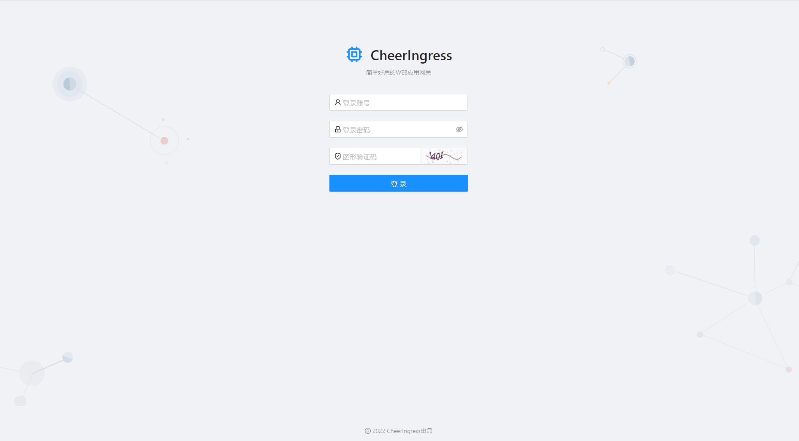
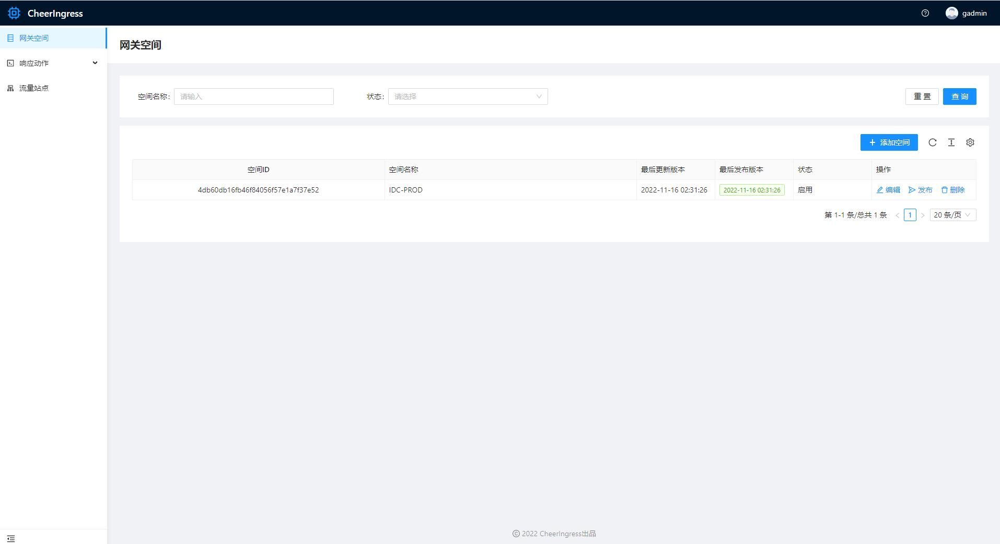
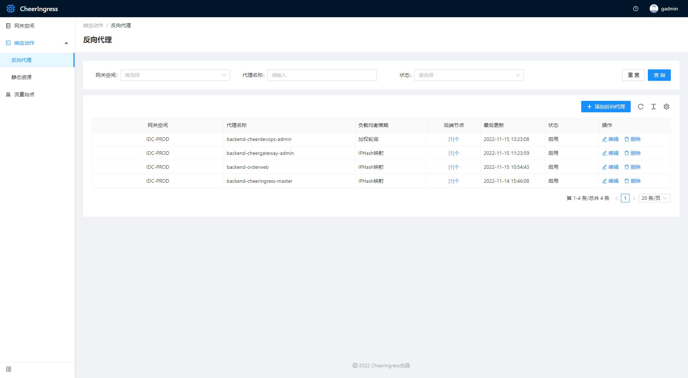
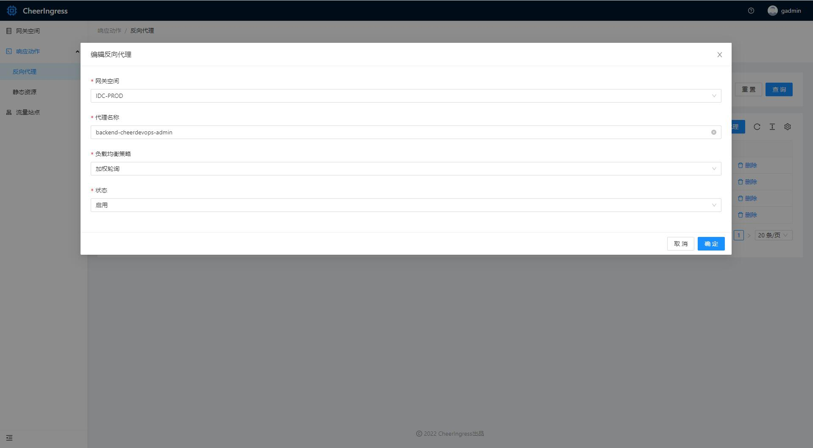
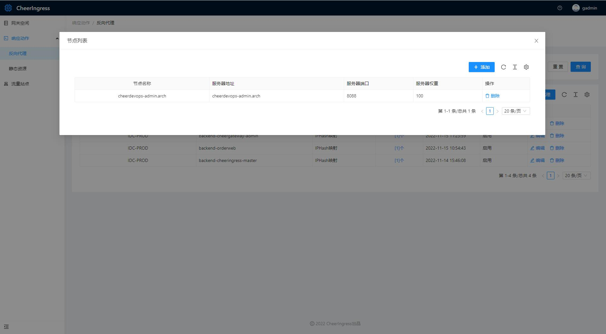
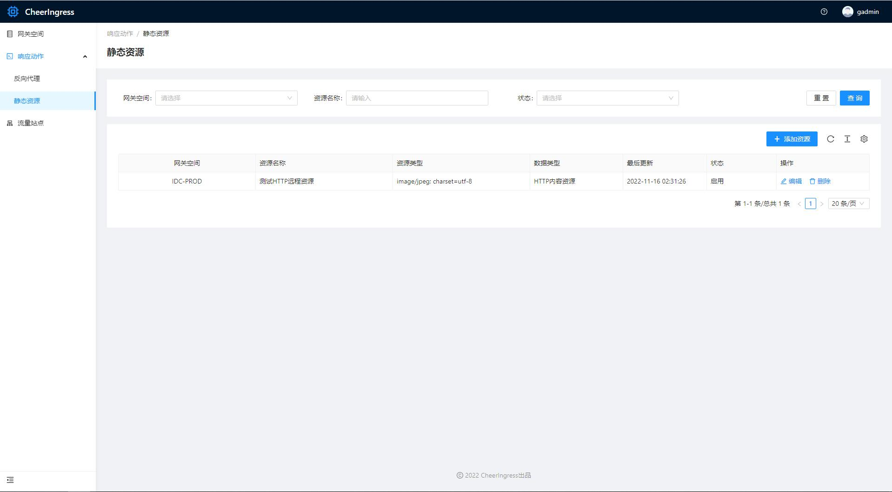
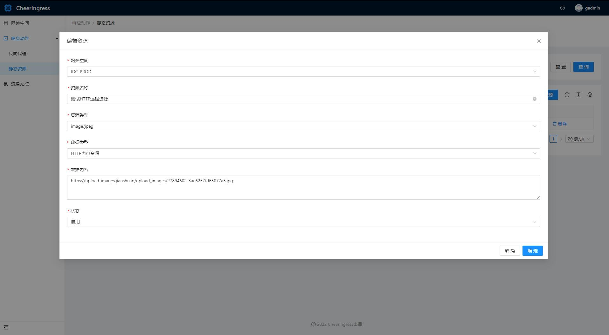
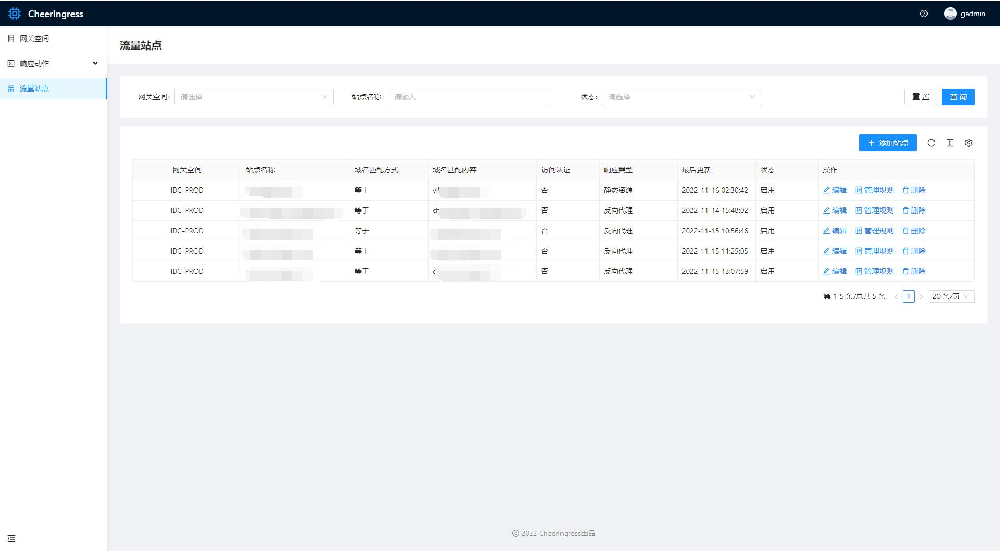
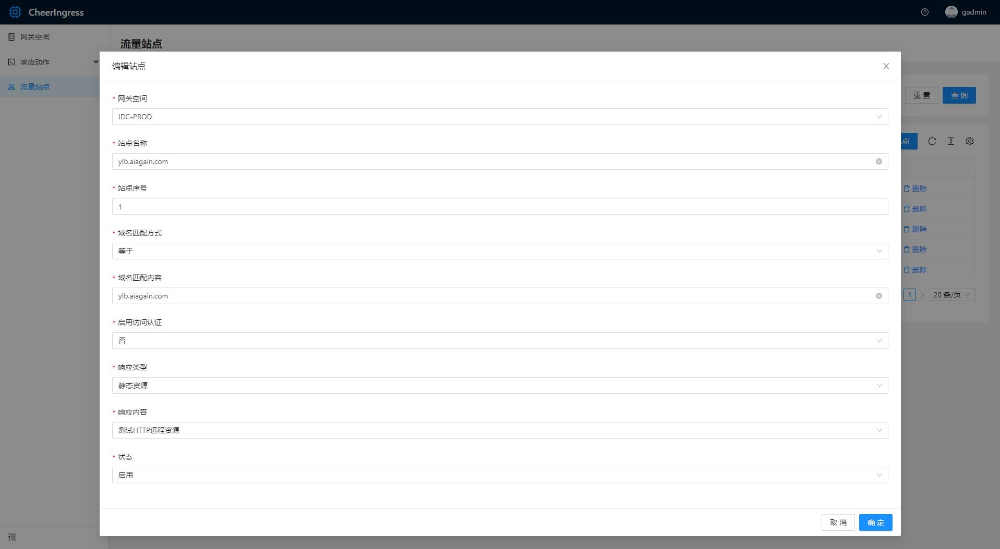
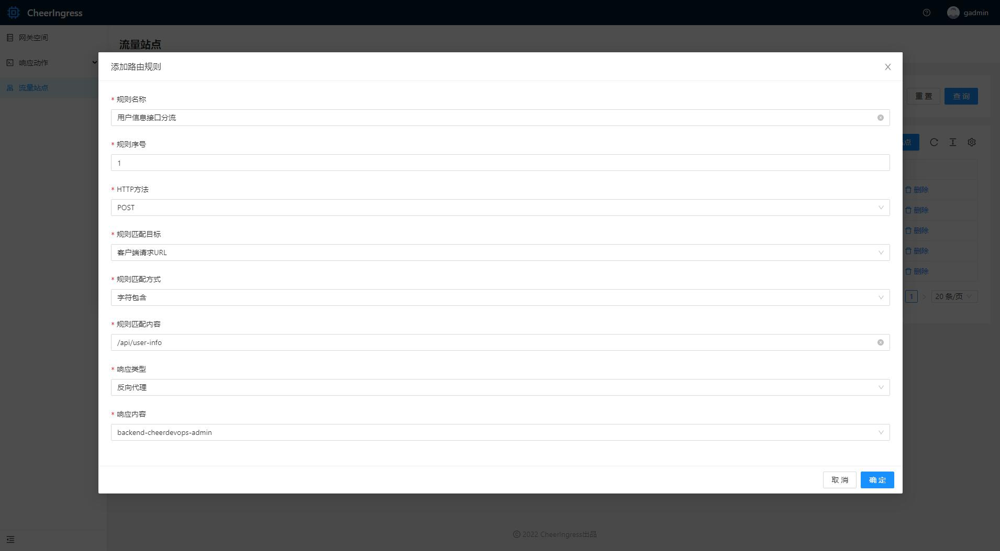
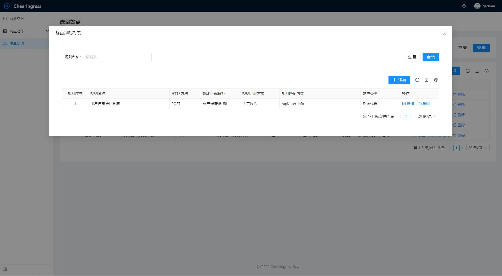
